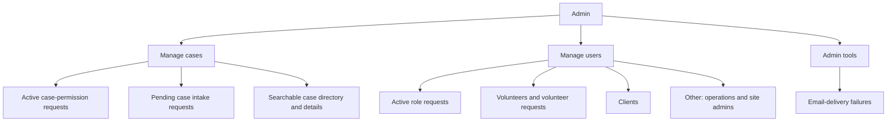

# Rebuild Admin around Manage cases and Manage users

## Why this needs a redesign

The current `/admin` page presents four peer tabs — Case Requests, Volunteers,
Case access, and Requests — even though they are fragments of two jobs: managing
cases and managing people. The labels also hide what the screens actually do:
"Case access" is primarily a user editor, while "Requests" mixes role changes
and case-permission changes. Email-delivery diagnostics are attached to the user
editor even though they are unrelated.

There is also a functional gap behind the UX problem. An operations or site
admin can search all case names from the assignment picker, but cannot open an
unassigned case: normal case loading requires an explicit `ViewCase`
assignment. This task must add admin **read** access without silently granting an
assignment or any write/chat permissions.

## Target information architecture

`Manage cases` and `Manage users` are the only primary tabs. Use route-backed
links (with `/admin` defaulting to Manage cases) so the selected workspace and an
open case/user can be refreshed, bookmarked, and reached with browser Back.
Style them as tabs, but use ordinary navigation semantics rather than an
incomplete ARIA tab widget. On narrow screens the two choices must remain
obvious and usable.

Keep email-delivery failures available in a small, collapsed `Admin tools`
section outside the primary workspaces rather than pretending they are case or
user management.

## Manage cases

### 1. Active case-permission requests first

- Put active `AdminRequestKind::CaseCapabilities` requests at the top under the
  explicit heading **Active case-permission requests**.
- A site admin sees the full actionable queue and can approve or deny requests.
  An operations admin sees the active requests they filed and their status, as
  today.
- Keep a collapsed, server-filtered case-permission request history below the
  active queue. Filtering must happen in the query/count, not after paginating a
  mixed role/case result set.
- A request links to both the affected case and target user's profile.

### 2. Pending case intake requests

- Preserve the current client case acceptance/decline workflow under a clearly
  separate **Pending case requests** heading.
- Add `View details` to each request so an admin can inspect the case and client
  profile before deciding. Declines still require a client-facing reason.
- Both operations and site admins retain the current ability to decide case
  intake requests.

### 3. Search and open every case

- Add a paginated case directory with a labelled search field. Search by case
  name, case ID, and client/owner name; show ID, owner, status, inactivity, and a
  concise access state in each result.
- Clicking a result opens a stable admin case detail URL and offers an obvious
  way back to the same search results.
- Reuse/extract the existing case detail presentation rather than building a
  divergent second rendering. The admin view includes the case header and
  linked client profile, terms acceptance, notes, case information, evidence,
  and case change log.
- Any operations or site admin can open those details without assigning the case
  to themselves. An unassigned admin sees an explicit **Admin read-only view**
  notice and no capability-backed editing controls.
- If the admin already has case capabilities, show only the actions those stored
  capabilities permit. Do not infer write privileges from the admin role.

### Read-access boundary

Implement a dedicated server-side admin read path/helper rather than weakening
`require_cap` globally:

- operations and site admins may list/search and hydrate any case for this admin
  detail view;
- they may read/download evidence and read the case audit history from that
  detail view;
- volunteer-only case material remains staff-only, using the existing visibility
  filtering;
- every mutation (rename/status, notes, properties, files/folders, channels,
  etc.) continues to use its existing capability or site-admin gate;
- inbox/chat/channel access and unread notifications remain assignment-scoped;
- viewing a case must not insert a `case_assignments` row, send an assignment
  notification, or make the case appear in the admin's normal Cases/Inbox list.

## Manage users

Place active `AdminRequestKind::Role` requests at the top as **Active role
requests**, with the same site-admin action / operations-admin tracking split and
a separately filtered history.

Below one labelled user search, render three independently paginated sections
built from the exact `users.role` value. Do not use
`has_volunteer_privileges()` for grouping because it also includes admins.

### Volunteers

- Show pending volunteer applications first, including applicant, contact link,
  accepted date, skills/focus, and status. Operations admins can inspect this
  queue read-only; only site admins receive Approve/Deny controls because an
  approval changes the account role.
- List exact `Volunteer` accounts with name, email, agreement status, and a
  concise summary of case access.
- `View profile` opens the existing admin-readable profile details (contact,
  volunteer details, hours, application/agreement, and the audited site-admin
  SSN reveal flow) rather than bulk-loading all sensitive fields into every row.
- `Manage` opens focused Account role and Case access sections.

### Clients

- List exact `Client` accounts with name, email, available contact summary, and
  case-access summary.
- Provide clear `View profile` and `Manage` actions. The management view supports
  account role and per-case access changes through the permission rules below.

### Other

- Put exact `OperationsAdmin` and `SiteAdmin` accounts under the requested
  **Other** heading, with an explanatory subtitle and distinct role badges.
- Show the same profile, role, case-access, and audit affordances where the
  viewer is authorized. Mark the signed-in account as `You`.

### Role and case-access behavior

Split the oversized current user card into a concise directory row plus a lazy
management panel/page. Give global role and case access their own headings so a
role selector is not hidden inside case-capability edit mode.

Preserve the existing authority model:

| Action | Operations admin | Site admin |
| --- | --- | --- |
| View user/profile and assignments | Yes | Yes |
| Change own case capabilities | Direct | Direct |
| Change another user's case capabilities | Submit request | Direct |
| Change another user's account role | Submit request | Direct |
| Decide role/case-permission requests | No | Yes |
| View volunteer applications | Read-only | Yes |
| Decide volunteer applications | No | Yes |

All changes continue through the existing audited role/capability paths,
capability prerequisite validation, stale-request checks, and notifications.
Protect against demoting the final site admin in both direct role changes and
approved role requests, while retaining the volunteer/client subtype invariants.

## Data and component work

- Add server-filtered, paginated admin case directory queries and role-grouped
  user directory queries with accurate per-section totals.
- Avoid the current per-user assignment N+1 query: batch assignment summaries or
  load full assignment details only when `Manage` opens.
- Use a narrow user-directory DTO so phone/address and volunteer-sensitive data
  are fetched only for an opened profile/management view.
- Extend admin-request listing/history/counting to filter by request kind, and
  split badge counts so the Manage cases and Manage users attention indicators
  match their actual queues. Keep the top-level Admin badge as the total pending
  work visible to the caller.
- Let operations admins list pending volunteer applications, but keep decision
  functions site-admin-only.
- Extract/reuse small UI primitives where they remove existing duplication:
  section heading/count, status pill, decision card, empty/error state, and
  paged-search footer. Do not introduce a generic abstraction that obscures the
  role- and case-specific behavior.
- Preserve request/user/case search state when opening a detail and returning.

## Accessibility and interaction quality

- Every search field has a visible label; placeholders are examples, not labels.
- Toggles expose `aria-expanded`/`aria-controls`; loading and decision feedback
  is announced without replacing the whole workspace.
- Decision notes and decline reasons have associated labels and disabled/busy
  states.
- Search results, management controls, and case/user links are keyboard usable.
  If a custom typeahead remains, give it proper combobox keyboard/ARIA behavior.
- At mobile widths, cards stack actions without horizontal clipping and detail
  views provide a clear Back action. At desktop widths, use a focused
  directory/detail layout rather than a wall of fully expanded user cards.
- Use consistent headings, helper text, card treatment, empty states, and counts
  in both workspaces.

## Acceptance criteria

1. `/admin` presents only the primary `Manage cases` and `Manage users` choices,
   defaults to Manage cases, and each workspace/detail is deep-linkable.
2. Active case-permission requests are the first Manage cases section; case
   intake requests and a searchable all-case directory follow.
3. An unassigned operations admin and an unassigned site admin can each search,
   open, inspect, and download readable evidence from any case, then open its
   client profile, without creating an assignment.
4. That same unassigned admin cannot mutate the case or enter its chat. Direct
   calls to existing write/channel APIs still fail without the relevant stored
   capability.
5. Manage users shows searchable Volunteers, Clients, and Other sections with
   accurate totals. Every listed person has obvious profile and management
   actions.
6. Volunteer applications appear at the top of Volunteers for both admin roles;
   they are read-only for operations admins and actionable for site admins.
7. Site-admin role and case-access edits apply directly. Operations-admin edits
   to other users create the correctly typed request and appear in the matching
   active queue. Role and case request histories do not mix.
8. Approve/deny actions refresh their section and all relevant tab/nav badges
   without a page reload.
9. Email-delivery failures remain available under collapsed Admin tools, not
   inside a case/user directory.
10. Existing assignment-scoped Cases, Inbox, notification, write authorization,
    volunteer SSN handling, auditing, and role/subtype integrity continue to
    behave as before.

## Verification

- Run `etc/dev.sh -- cargo check --no-default-features --features ssr` and the
  repository's formatting checks. Do not add Cargo tests; this repository does
  not use them.
- Build and run with `etc/dev.sh build` then `etc/dev.sh run`; wait for
  `MH_READY`.
- Browser-check desktop and mobile layouts as both seeded site admin and
  operations admin.
- Exercise case search/open/back, pending case decisions, filtered request
  decisions/history, grouped user search/pagination, volunteer decisions, direct
  site-admin edits, and operations-admin request submission.
- For a case not assigned to either test admin, verify before and after that no
  assignment row is created; confirm case details/evidence reads work, while
  write and chat APIs remain denied.
- Exercise role transitions through both direct and request-approval paths and
  confirm the volunteer/client resource invariants still hold and the final site
  admin cannot be demoted.
- Check browser console output after each focused interaction and verify the
  keyboard/mobile flows do not clip or strand the user.
