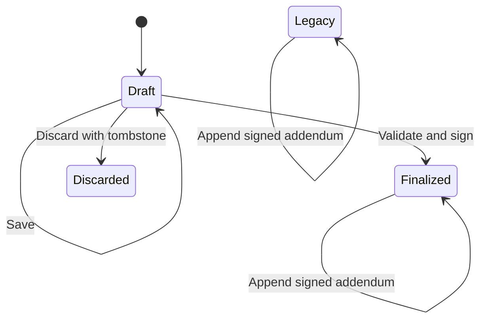
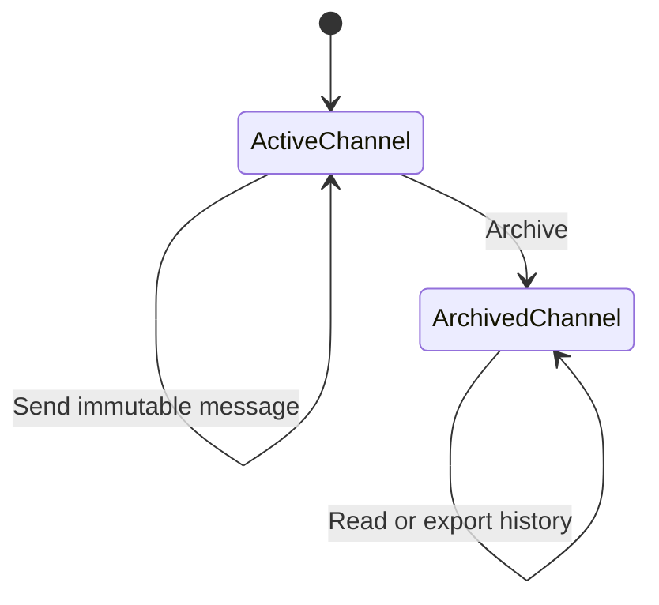

# Build a secure case-management MVP

## Goal

Evolve the existing Mommy's Heart application into a credible, bounded
case-management MVP without attempting to reproduce the client's entire
19-section specification at once.

The MVP will build on the application's existing cases, assignments,
capabilities, files, authentication, MFA, case chat, notifications, and change
log. It will deliver two missing foundations:

1. authenticated and auditable text messaging between clients and assigned team
   members; and
2. structured staff Case Notes with drafts, finalization, signatures, immutable
   addenda, and useful case-level filtering.

The implementation must also add a maintained product/specification area under
`docs/case-management/`. That area will define the MVP precisely and turn the
remaining client request into an ordered roadmap rather than leaving it as an
unbounded document.

## Product boundary

For this MVP, **secure messaging** means authenticated in-app communication,
server-enforced case and channel authorization, separation of shared and
volunteer-only audiences, immutable message content, durable audit metadata,
and content-free external notifications. It does not mean end-to-end encryption,
a legal/compliance certification, guaranteed emergency delivery, or a substitute
for Mommy's Heart's safety procedures.

For this MVP, a **Case Note** is a formal internal service record authored by a
volunteer or administrator. It is different from:

- case chat, which is communication between people;
- the Change Log, which is automatic audit metadata; and
- legacy free-text notes, whose historical audience must be preserved.

The UI and documentation must use specific terms such as "case management",
"Case Notes", and "Case Chat" rather than rebranding the whole application as a
CRM.

## Existing foundation to preserve

- Access is based on stored per-case capabilities; owning or administering a
  case does not silently grant case access.
- Standard chat channels are visible to clients and assigned staff with
  `ViewCase`; sending requires `SendMessages`.
- Every case has one volunteer-only channel that client accounts cannot discover
  or access, even if a client is accidentally granted broad capabilities.
- Case files already support shared and volunteer-only visibility.
- Account authentication, MFA, password reset, unread chat badges, email
  notifications, and the case Change Log continue to work.
- Existing free-text notes and messages must survive migration.

## Requirements

### Secure case messaging

- **REQ-MSG-001 — Audience authorization.** When a user lists a channel, reads a
  transcript, sends a message, marks messages read, or exports a transcript, the
  system shall resolve the channel's stored case and audience and enforce access
  on the server. A client shall never receive volunteer-only channel metadata,
  message content, unread counts, audit entries, or exports.
- **REQ-MSG-002 — Immutable messages.** Once sent, message author, audience,
  timestamp, and body shall not be editable or permanently deletable through the
  application.
- **REQ-MSG-003 — Channel archival.** When an authorized manager removes a
  standard channel from active use, the system shall archive it instead of
  deleting it or its messages. Archived channels remain readable to authorized
  users, reject new messages, and remain available to authorized exports. The
  volunteer-only channel remains permanent. At least one active shared channel
  must remain on every non-declined case.
- **REQ-MSG-004 — Atomic send record.** When a message is accepted, the message,
  its eligible-recipient records, and content-free audit metadata shall commit
  together. A failed audit/recipient write shall fail the send rather than leave
  an unaudited message. Best-effort email delivery happens only after commit.
- **REQ-MSG-005 — Durable first-read evidence.** When an authorized user first
  receives message content from the server, the system shall preserve that
  user's first-read timestamp without overwriting it on later reads. Existing
  unread rows shall migrate without inventing historical read dates that are not
  known. Routine chat UI need not expose who read a message; authorized transcript
  exports may include this evidence.
- **REQ-MSG-006 — Safe notifications.** Email and browser notification summaries
  for new messages shall contain no message body, attachment, case name, client
  name, channel name, or other case detail. They may say only that a new secure
  message is waiting and direct the recipient to sign in. A user's existing
  notification opt-out remains honored.
- **REQ-MSG-007 — Validated text-only MVP.** The system shall trim messages,
  reject empty content, enforce a documented maximum length on both client and
  server, prevent duplicate submission while a send is in flight, and apply a
  reasonable server-side send throttle. Message attachments, editing, reactions,
  delivery by SMS, and email replies are deferred.
- **REQ-MSG-008 — Authorized export.** An operations or site administrator who
  also has `ViewCase` shall be able to download a UTF-8 CSV transcript of a
  channel they are allowed to see. The export shall include case/channel
  identifiers, archived state, message identifiers, author identifiers and name
  snapshots, server timestamps, bodies, and available first-read evidence. Every
  export shall itself create restricted audit metadata. PDF transcript output is
  deferred.
- **REQ-MSG-009 — No metadata side channel.** Counts, search results, unread
  state, audit queries, and inactive-case calculations shall apply the same
  audience rules as message reads.

### Structured Case Notes

- **REQ-CN-001 — Internal notes and preserved legacy audience.** New structured
  Case Notes shall be visible only to non-client users with `ViewCase`. Existing
  free-text notes shall migrate to an immutable `Legacy` state while preserving
  their existing shared audience so the migration does not silently revoke or
  widen historical access. Clients shall receive neither structured-note content
  nor metadata/counts indicating that internal notes exist.
- **REQ-CN-002 — Authoritative identity.** The server shall populate the author
  user ID, display-name snapshot, account-role snapshot, case ID, creation time,
  update time, and finalization time. The browser shall not be trusted to supply
  author, role, case status, or timestamps.
- **REQ-CN-003 — Draft lifecycle.** A non-client user with `AddNotes` may create
  and explicitly save an incomplete draft and return later. Only the author may
  edit or finalize that draft. Other assigned team members shall not see it until
  finalization; an operations/site administrator with `ViewCase` may inspect it
  but may not rewrite it. Discarding a draft shall preserve a restricted,
  auditable tombstone rather than hard-delete the row.
- **REQ-CN-004 — Bounded structured form.** The MVP form shall capture:
  - activity date, start time, end time, calculated total minutes, optional
    location, and delayed-entry reason when the activity date is not today;
  - one primary interaction/activity type from the client's supplied list;
  - contact category, direction, completion outcome, and participant summary;
  - one or more related service areas;
  - purpose/objective;
  - client-reported information and separately verified/observed information,
    with information-source selections;
  - actions taken;
  - client response/outcome and progress/barriers;
  - safety/urgency level and details when above routine;
  - next steps; and
  - a concise factual narrative.

  Fields may offer `Unknown`, `Client declined`, and `Not applicable` where
  relevant. Repeatable participant records, multiple primary activities, and all
  19 original sections are deferred.
- **REQ-CN-005 — Finalization validation.** Drafts may be incomplete. Before
  finalization the server shall require valid non-future activity timing, an
  interaction type, contact category, at least one service area, purpose,
  actions, outcome, urgency, next steps or an explicit not-applicable choice, and
  narrative. End time must follow start time for the MVP's same-day activity
  model. Elevated urgency requires details. Delayed entry requires an
  explanation.
- **REQ-CN-006 — Electronic attestation.** To finalize, the author shall confirm
  review/accuracy and type their current full name. The server shall verify that
  name against the authenticated user and store the name and server signing time.
  This is an authenticated in-app attestation, not a qualified digital signature.
- **REQ-CN-007 — Immutable final record.** Finalization is terminal. A finalized
  or legacy note shall not be edited, reverted to draft, discarded, or permanently
  deleted through the application.
- **REQ-CN-008 — Signed addenda.** A non-client user with `AddNotes` may append a
  signed addendum to a finalized or legacy note. An addendum shall record its own
  author identity/role snapshots, reason, supplemental or corrected information,
  affected categories, follow-up, signature, and server timestamp. It inherits
  the original note's audience and is immutable. The original remains visible.
- **REQ-CN-009 — Case-level list and filters.** Authorized users shall see notes
  for one selected case, newest activity first, with server-side pagination and
  filters for date range, author, primary interaction, note state, urgency, and
  keyword. Draft and discarded records follow REQ-CN-003 visibility. Global
  cross-client search is deferred.
- **REQ-CN-010 — Restricted auditing.** Creating, saving, discarding, finalizing,
  viewing through an administrative draft-inspection path, exporting, and adding
  an addendum shall create content-free restricted audit metadata. Note bodies
  and client-reported facts shall not be copied into the generic Change Log.
- **REQ-CN-011 — Safety warning.** The form shall clearly state that recording an
  urgent or emergency concern does not contact emergency services or replace the
  organization's escalation procedure. Automated safety escalation is deferred
  and must not be implied by the UI.

### Audit visibility and data integrity

- **REQ-AUD-001 — Audience-aware audit records.** Change Log records shall carry
  `shared` or `volunteer_only` visibility. Existing entries default to shared.
  Every audit query shall filter restricted entries server-side based on account
  role and case access, regardless of whether the current UI normally exposes
  that query.
- **REQ-AUD-002 — Content minimization.** Message and Case Note audit entries
  shall identify the action and record ID but shall not duplicate message bodies,
  note narratives, client names, safety details, or other substantive content.
- **REQ-AUD-003 — Relational consistency.** The database shall prevent a message
  from naming a case different from its channel's case and shall prevent channel
  deletion from cascading away message history.
- **REQ-AUD-004 — Honest retention.** Messages, finalized notes, addenda, archived
  channels, and discarded-note tombstones shall have no application hard-delete
  path in the MVP. Documentation shall accurately state the existing audit-log
  retention window and identify legal holds and organization-approved retention
  policy as future operational work; it shall not claim indefinite or certified
  retention where none exists.

### Documentation and roadmap

- **REQ-DOC-001 — Requirements-first documentation.** Create
  `docs/case-management/` as the engineering/product specification home. It shall
  contain a README/glossary, secure-messaging requirements and Allium lifecycle
  spec, Case Note requirements and Allium lifecycle spec, executive status files,
  and a shared ADR chain for material decisions. Stable requirement IDs shall be
  traceable into implementation comments and verification notes.
- **REQ-DOC-002 — Roadmap coverage.** Add a roadmap mapping every major area of
  the client's supplied specification to `MVP`, `next`, `later`, or `needs policy
  decision`, with dependencies and acceptance questions. The roadmap shall not
  imply that deferred behavior already exists.
- **REQ-DOC-003 — Future feature briefs.** Add concise future briefs/specs for:
  1. supervisor review, returned revisions, approval, urgent safety alerts, and
     escalation acknowledgement;
  2. referrals, outside providers, service records, programs, client goals, and
     service-plan objectives;
  3. tasks, reminders, court proceedings, deadlines, and Case Timeline events;
  4. Case Note/message attachments, document metadata/linking, PDF generation,
     and stronger signature options;
  5. detailed time/service units, grants/funding codes, funder reporting, and
     global authorized search;
  6. granular sensitive-note permissions, break-glass access, access reviews,
     safe-contact preferences, and field-level restrictions; and
  7. operational governance: retention/legal holds, backups and restore drills,
     incident response, malware scanning, accessibility, data migration/export,
     and independent security/compliance review.
- **REQ-DOC-004 — Documentation isolation.** Explain that Markdown under
  `docs/case-management/` is maintained product documentation and is not part of
  the `.docx` client resource library or its current RAG ingestion path.

## Lifecycle specifications

The Allium specs shall, at minimum, make these transitions and invariants
normative:

Invariants include:

- a client can never observe volunteer-only records or their metadata;
- final notes, legacy notes, addenda, and sent messages never change content;
- archived channels reject sends and preserve messages;
- Case Note addenda never replace their parent;
- first-read time is write-once;
- all record timestamps used for ordering/audit come from the server; and
- a failed required audit write prevents the associated official action.

## Implementation shape

The exact schema is an implementation decision to record in an ADR, but the
work is expected to include:

1. New forward-only migration(s) after `0016` for channel archival, authoritative
   message timestamps/receipts and relational constraints, audience-aware audit
   rows, structured Case Note lifecycle fields, and addenda.
2. Focused DB and server-function modules for Case Notes instead of continuing
   to grow `cases.rs`; register them through the existing `db` and `server_fns`
   module structure.
3. Transactional persistence for message send, channel archive, note finalization,
   addendum creation, and their required audit metadata.
4. Audience filtering in repository queries as a second defense behind server
   functions.
5. A dedicated Case Note create/detail route suitable for a long form, plus a
   paginated/filterable Case Notes panel in the selected case.
6. Migration of existing free-text notes to immutable legacy records and existing
   unread data to the new receipt/read model without fabricating history.
7. Updated seed/mock data for each state and audience.
8. Content-free message notification templates and copy.
9. An authorized CSV transcript download endpoint with explicit download
   authorization and audit.
10. Concise comments, generally no more than one or two sentences, consistent
    with repository conventions.

## Explicitly deferred from the MVP

- The full 19-section dynamic Case Note form and repeatable sub-records
- Supervisor review/approval/return state machine
- Automated emergency or urgent-safety escalation
- Referral, provider, service-plan, program, goal, court, and timeline records
- Tasks, reminders, deadline automation, and calendar integration
- Message and Case Note attachments or direct evidence links
- PDF generation
- Multiple sensitivity tiers or field-level Case Note permissions
- Global cross-case Case Note search
- Detailed service/time/grant reporting and automatic volunteer-hour updates
- Message editing, deletion, reactions, SMS, email reply ingestion, or real-time
  sockets
- End-to-end encryption, formal digital signatures, legal holds, and any claim of
  HIPAA/VAWA/SOC 2 or other certification

These are not forgotten requirements; REQ-DOC-002 and REQ-DOC-003 require them
in the roadmap with enough context for later requirements work.

## Implementation sequence

1. Author the requirements, Allium specs, ADR(s), executive skeletons, and roadmap
   under `docs/case-management/`; resolve contradictions before schema work.
2. Add and verify forward-only migrations and legacy backfills.
3. Harden messaging persistence, authorization, notifications, archival, read
   evidence, and transcript export.
4. Implement the Case Note domain/server layer and lifecycle transactions.
5. Add the Case Note pages, list/filter UI, lifecycle actions, warnings, and
   legacy rendering.
6. Complete traceability/status docs and run the full validation matrix.

## Acceptance scenarios

### Messaging

- A client and assigned volunteer can exchange text in a standard channel.
- The same client cannot discover or access the volunteer-only channel by UI,
  direct server-function call, unread payload, audit query, count, or export.
- Revoking `SendMessages` immediately blocks sending while `ViewCase` continues
  to allow authorized reading.
- Archiving a channel removes its composer but retains its complete readable
  history; a direct send attempt fails.
- Archiving the last active shared channel is refused.
- A sent message cannot be edited or deleted; the send, recipient state, and
  metadata audit either all commit or none do.
- The first authorized read is retained and later reads do not replace its time.
- New-message email contains no case or message detail.
- An assigned operations/site admin can export an allowed channel and the export
  is audited; unauthorized and cross-audience exports fail without leaking
  existence.

### Case Notes

- A volunteer with `AddNotes` can create an incomplete draft, leave, reload, and
  continue it.
- Another ordinary volunteer on the same case cannot see that draft; an assigned
  operations/site admin can inspect but not edit it.
- Finalization fails with specific errors for missing required fields, invalid
  timing, unexplained delayed entry, elevated urgency without details, or a
  signature that does not match the authenticated author.
- A valid signed draft becomes immutable and visible to assigned non-client case
  viewers.
- A client cannot discover the structured note through UI, direct API, counts,
  filters, keyword search, or Change Log metadata.
- A signed addendum appears beneath its immutable parent and cannot be edited or
  deleted.
- A legacy note keeps its pre-migration content, author label, timestamp, and
  shared audience, is visibly labeled Legacy, and accepts only immutable
  addenda.
- Filtering and pagination work without loading the entire case-note history.
- Routine and elevated-urgency notes both show the warning that the app is not an
  emergency dispatch mechanism.

### Documentation

- Every MVP requirement has a stable ID, appears in executive status tracking,
  and is traceable to implementation/verification.
- The roadmap accounts for all sections and submission/search outcomes in the
  client's original request.
- Future briefs state user need, boundaries, dependencies, open policy questions,
  and acceptance outcomes without pretending to specify unsupported behavior as
  current.

## Verification

Follow the repository workflow; do not add permanent `cargo test` suites.

1. Format and fast SSR compile:
   - `cargo fmt --check`
   - `etc/dev.sh -- cargo check --no-default-features --features ssr`
2. Build both SSR and hydrated outputs with `etc/dev.sh build`.
3. Reset a development database and verify fresh seed/migration behavior with
   `etc/dev.sh reset`.
4. Exercise migration/backfill behavior against a pre-MVP database snapshot so
   legacy notes, messages, and unread state are preserved.
5. Start with `etc/dev.sh run`, wait for `MH_READY`, and conduct browser passes at
   desktop and mobile widths using client, volunteer, operations-admin, and
   site-admin accounts.
6. For every sensitive read/write/export server function, exercise both an
   authorized call and direct unauthorized/cross-case/cross-audience calls.
7. Inspect the database after lifecycle operations to confirm immutability,
   first-read write-once behavior, archive preservation, addendum parentage,
   content-free audit records, and transaction rollback on forced audit failure.
8. Inspect email dry-run/preview output to confirm new-message notifications
   contain no substantive or identifying case content.
9. Check browser console/network errors and verify pagination, reload persistence,
   loading states, duplicate-submit prevention, and accessible labels/errors.
10. Validate Allium syntax with the available tooling and update executive status
    only after the corresponding scenario passes.

## Definition of done

The MVP is complete when its code, schema, UI, documentation, and observable
behavior agree; historical data is preserved; audience boundaries withstand
direct-call testing; messaging and official records cannot be silently erased;
and the documentation clearly distinguishes delivered capability from future
roadmap work.
