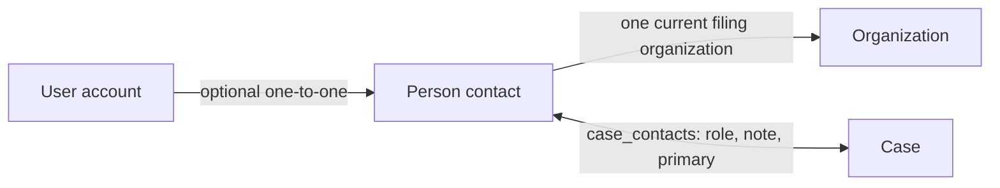

# Make people, organizations, and cases work as connected records

## Goal

The phase-2 data model already has the right canonical relationships:

- a `users` row is a sign-in account and an optional linked `contacts` row is the
  person behind it;
- `contacts.organization_id` files a person under one current organization; and
- `case_contacts` links a person to any number of cases with a role, note, and
  primary flag.

The missing piece is usability and consistency. Organization pages only list
people already filed there, person pages do not show their cases, newly
registered accounts do not receive person records, and only people—not
organizations—support custom properties. New records also lack a small,
consistent set of ordinary CRM fields.

Build the missing bidirectional workflows around the existing canonical data,
seed low-sensitivity default properties, and close the authorization and archive
checks those workflows expose. Do not create parallel relationship stores.

## Product and data decisions

1. **Accounts are not a second person object.** Default properties requested for
   a user belong to the linked person record. Authentication, email ownership,
   account role, and case capabilities remain on `users` and are never copied to
   custom properties.
2. **Keep the current single-organization model.**
   `contacts.organization_id` means the person's current primary filing
   organization. Organization and person screens are two views over that one
   foreign key. Multiple affiliations, affiliation history, and organization-
   specific titles require a future first-class affiliation model; do not fake
   them with custom properties.
3. **Keep `case_contacts` canonical.** A person-side case panel reads and mutates
   the same rows as the case-side people panel. Navigating from a person does not
   grant case rights.
4. **Defaults are ordinary properties.** They are stored as blank, editable
   key/value rows in the existing ordered section model, not as a second schema
   or a special uneditable UI. First-class fields are never duplicated as custom
   properties.
5. **Default templates are code-owned and versioned by migration.** This matches
   the existing new-case fields: a deployment can review the exact org-wide
   defaults. A template change affects new records; backfilling an added field
   into old records is always an explicit, non-destructive migration decision.
6. **No sensitive defaults.** The current contact-property model is visible to
   staff and has no field-level sensitivity or break-glass access. Do not add
   birth date, SSN/government ID, immigration, diagnosis, safety-plan, shelter
   location, legal strategy, or similar fields.

## Requirements

### Default properties

- **REQ-CRM-025 — Default person properties.** Whenever the system creates a
  person, it shall create the following named, blank properties in the same
  transaction:

  | Section | Property |
  | --- | --- |
  | Communication | Preferred contact method |
  | Communication | Best time to reach |
  | Communication | Preferred language |
  | Relationship | Relationship status |
  | Relationship | Last contacted on |
  | Relationship | Next follow-up on |

  Existing first-class contact fields—names, email, phone, mobile, address, job
  title, organization, types, source, notes, do-not-contact, archived state, and
  account link—shall not be duplicated.

- **REQ-CRM-026 — Organization properties.** Organizations shall support the same
  ordered, sectioned property editing experience as people, without a visibility
  axis. Every new organization shall receive these named, blank properties in
  the create transaction:

  | Section | Property |
  | --- | --- |
  | Relationship | Relationship status |
  | Relationship | Preferred contact method |
  | Relationship | Last contacted on |
  | Relationship | Next follow-up on |

  Existing first-class organization fields—name, kind, website, email, phone,
  address, notes, and archived state—shall not be duplicated.

- **REQ-CRM-027 — Safe default backfill.** A forward migration shall add any
  missing default person properties to existing contacts and all default
  organization properties to existing organizations. Matching is by normalized
  section and property name; an existing row and its value shall always win.
  Defaults shall append without reordering or overwriting existing custom rows.
  Both property panels shall also offer an admin-only **Add missing defaults**
  action that is idempotent and preserves every existing row.

### Organization ↔ person workflow

- **REQ-CRM-028 — Link people from an organization.** On organization detail, an
  administrator shall be able to:
  1. search active people server-side and file an existing person under the
     organization;
  2. create a new person with the organization preselected; and
  3. remove a person from that organization when doing so would still satisfy the
     contact naming constraint.

  The picker shall show the person's current organization. Filing an unassigned
  person is a single confirmed action; moving someone from another organization
  requires an explicit confirmation naming both organizations. Existing links
  to archived people continue to render, while archived people are not offered
  as new choices.

- **REQ-CRM-029 — One organization source of truth.** Organization-side linking,
  person editing, and contact creation shall all write only
  `contacts.organization_id`. A move or removal shall update the person and write
  understandable relationship entries to both affected organization logs and
  the contact log in the same transaction. An archived organization may keep and
  display existing people but shall reject new or moved-in links at the server
  boundary.

- **REQ-CRM-030 — Navigable relationship.** A person summary shall link to their
  organization, and every organization person row shall link to that person.
  Empty and archived states shall be stated plainly. No staff-facing screen shall
  render a link to an admin-only route that the current viewer cannot open.

### Person ↔ case workflow

- **REQ-CRM-031 — Cases on a person.** Person detail shall include a **Cases
  involving this person** panel listing every stored case-contact link the admin
  may inspect, with case ID/name, status, role, primary flag, and note. Every row
  shall link to the stable admin case route.

- **REQ-CRM-032 — Manage case links from either side.** From person detail, an
  administrator with `EditCase` on a target case shall be able to search their
  editable cases, add this person with role/note/primary values, edit those
  values later, and remove the link. The case-side people panel shall gain the
  same edit action and a server-side person typeahead instead of downloading the
  first 200 contacts. Both surfaces shall call the same server functions and
  refresh consistently.

- **REQ-CRM-033 — Case authorization remains case-owned.** Reading through the
  dedicated admin detail path may use the existing admin-read exception. Every
  add, edit, primary change, and removal shall resolve the owning case from
  stored data and require the caller's stored `EditCase` capability; operations-
  admin or site-admin status alone shall not grant a write. Search results for
  adding from a person shall contain only cases the caller can edit. Declined or
  otherwise non-writable cases remain read-only.

- **REQ-CRM-034 — Case-link integrity and audit.** Existing uniqueness rules—one
  person/role pair and at most one primary person per case—shall remain database
  enforced. Promoting a primary shall demote the former primary transactionally.
  Duplicate attempts shall return a useful message. Existing links to archived
  people shall render and may be removed, but no new case link may target an
  archived person. Relationship audit shall be visible from both the case and
  person, identify the other endpoint and role, and never copy the free-text
  note into audit metadata.

### Accounts, signup, and existing data

- **REQ-CRM-035 — New accounts receive a person record.** Successful registration
  shall create a contact linked to the new user, classify it as a client, and add
  the default person properties in the same transaction as the account. There
  shall still be at most one contact per user, and the account remains the source
  of truth for identity, email, role, and authentication.

- **REQ-CRM-036 — Client signup creates the obvious case link.** When registration
  also materializes a case signup, the new linked person shall be added to that
  case as `Client` and primary in the same transaction. A migration shall do the
  equivalent for existing client-owned cases when the owner's linked person is
  not already present: add the client role, and mark it primary only when the
  case has no current primary person. Existing case-contact choices are never
  overwritten.

- **REQ-CRM-037 — Repair account/contact gaps.** The migration shall create the
  missing linked contact for any existing account that can satisfy the contact
  naming constraint, without replacing or relinking an existing person. It shall
  then add missing person defaults to all contacts. Seed/reset data shall follow
  the same invariants as runtime registration.

### Permissions, integrity, and scale

- **REQ-CRM-038 — Correct property permissions.** Clients shall have no CRM
  property access. Volunteers may read person and organization properties where
  current staff-read behavior permits it, but only operations/site admins may
  create, replace, restore defaults, or otherwise mutate them. Direct server-
  function calls shall enforce this; hiding buttons is not authorization.

- **REQ-CRM-039 — Active targets are server enforced.** Server writes shall reject
  newly filing a person under an archived organization and newly linking an
  archived person to a case. Existing archived relationships remain readable.
  Contact create/update shall validate that any submitted organization exists
  and is active. A person shall have at least one contact type, matching the
  phase-2 requirement that contacts carry one or more types.

- **REQ-CRM-040 — Searchable narrow pickers.** Person, organization, and editable-
  case relationship pickers shall use debounced, server-side typeahead with a
  bounded result count and narrow option DTOs. They shall not fetch full contact
  or organization records or silently cap a supposedly complete picker at 200
  rows. Search shall match the labels users can see, including organization name
  where useful.

- **REQ-CRM-041 — Transactional relationship writes.** Creating defaults,
  creating an account-linked person, moving organization membership, and
  adding/editing/removing case links shall commit their mutation and all required
  audit entries together. A failed audit write shall roll back the mutation.

### Finish the organization detail promised by phase 2

- **REQ-CRM-042 — Complete organization detail.** In addition to editable
  properties and people, organization detail shall show its grants to admins,
  linking each to grant detail, and shall render the organization's existing
  Change Log scope. This closes the unimplemented portion of the original
  `REQ-CRM-009`/`REQ-CRM-023` relationship view rather than creating another
  workspace.

- **REQ-CRM-043 — Honest maintained documentation.** Update delivered behavior,
  access summaries, glossary wording, and roadmap boundaries after verification.
  The roadmap shall keep duplicate detection/merge as phase 3.4 and explicitly
  record multi-organization affiliations/history as a later model decision.
  Volunteer emergency-contact promotion, referrals/service records, goals,
  reminders, sensitive-field controls, and client-facing CRM visibility remain
  separate work; this task shall not imply they exist.

## Implementation shape

1. Add a forward migration after `0019` that:
   - creates `organization_properties` with the same ordered section/key/value
     shape and delete behavior as `contact_properties`;
   - creates missing account-linked contacts without disturbing existing links;
   - non-destructively appends missing default properties to contacts and
     organizations; and
   - backfills missing client-owner `case_contacts` without replacing an existing
     primary.
2. Add small code-owned default-field catalogs, analogous to
   `helpers/new_case_fields.rs`, and transaction-aware insert/ensure helpers in
   the contact- and organization-property repositories. New contact and
   organization creation must call them before commit.
3. Add `organization_properties` domain/server/DB modules and extract/reuse the
   property-panel behavior where that reduces duplication without forcing case
   properties into the staff-only contact model.
4. Add narrow search endpoints for active contacts, active organizations, and
   cases on which the caller holds `EditCase`. Keep full-record list APIs for
   directories, not pickers.
5. Extend contact repository writes with an explicit transactional organization
   move path and active-organization validation. Organization quick actions and
   the normal contact form must converge on that behavior.
6. Extend `case_contacts` with reverse listing by contact and update support.
   Authorization for update/removal must derive the case from the stored link.
   Add transaction-aware creation for verified client signup.
7. Update `verify_registration` so account, client subtype, linked contact,
   defaults, optional case, primary client case link, and session-independent
   audit metadata either all materialize or none do.
8. Update the person, organization, and case panels for search, link, edit,
   archive states, permission-aware controls, error messages, loading states,
   accessible labels, and duplicate-submit prevention.
9. Add organization grant and Change Log panels using the existing filtered grant
   API and `AuditScope::Organization`; do not create a second grant query model.
10. Extend seed/reset behavior and maintained product documentation. Keep comments
    concise per repository convention.

## Explicitly out of scope

- Multiple or historical person/organization affiliations and household graphs.
- Duplicate contact merging. The new link flows should encourage searching
  before creating; phase 3.4 remains the place for fuzzy duplicate detection and
  transactional merge/repointing.
- Promoting volunteer emergency-contact columns into contacts, because a safe
  contact-to-contact relationship model and deduplication policy are not present.
- Referrals/service records, goals, Case Note links, tasks/reminders/deadlines,
  global search, import/export, donor campaigns, or accounting integration.
- Sensitive-field/break-glass permissions and client-facing CRM visibility,
  which remain blocked on policy.
- Replacing structured grant, funding, account, or case fields with generic
  properties.

## Acceptance scenarios

1. Creating a person manually produces exactly the six blank defaults in order;
   creating an organization produces exactly its four defaults. Both survive a
   reload and edit through the ordinary property UI.
2. Applying the migration to records with custom properties and a populated
   default-named property preserves every value and order, appending only missing
   defaults. Repeated **Add missing defaults** calls make no further changes.
3. A newly verified account has one linked client person with defaults. A case
   signup also has that person linked once as the primary Client, with no partial
   account/person/case state after an injected transaction failure.
4. On an organization, an admin searches for an unassigned person and files them,
   creates another person with the organization preselected, explicitly confirms
   moving a third person from another organization, and removes a valid link.
   Both endpoint change logs explain each change.
5. Direct calls attempting to file a person under an archived organization, add
   an archived person to a case, create a typeless contact, or let a volunteer
   replace person/organization properties are refused even when the UI is
   bypassed.
6. Person detail lists multiple cases/roles. An admin with `EditCase` adds,
   updates, promotes, and removes a link from the person page; the case page
   reflects each change immediately and its audit never contains the note.
7. An operations admin who can inspect a case but lacks `EditCase` sees the
   person-case row read-only and a direct mutation call fails. Granting
   `EditCase` makes the controls available; a declined case remains read-only.
8. Promoting a new primary person demotes the old primary atomically. Adding the
   same person with the same role yields a useful duplicate message, while a
   second distinct role remains allowed.
9. With more than 200 people/organizations/cases, typeahead finds a record beyond
   the old first-page boundary without downloading every full record.
10. Organization detail shows linked people, custom properties, related grants,
    and its Change Log. Person-to-organization navigation works both ways; a
    volunteer case view does not contain a dead `/admin/people/...` link.
11. A client can neither discover these records nor call their endpoints, and a
    volunteer cannot use the new admin relationship workflows.

## Verification

Follow the repository workflow and do not add permanent Cargo tests.

1. Run formatting and the isolated SSR compile check:
   `cargo fmt --check` and
   `etc/dev.sh -- cargo check --no-default-features --features ssr`.
2. Run `etc/dev.sh build` to compile SSR and hydrated WASM.
3. Run `etc/dev.sh reset` and inspect the database for property backfill,
   one-contact-per-account, client-owner case links, preserved existing
   primaries, ordering, and audit rows.
4. Start with `etc/dev.sh run`, wait for `MH_READY`, and exercise the acceptance
   scenarios at desktop and mobile widths as client, volunteer, operations
   admin, and site admin.
5. Exercise every new/changed server function directly with authorized,
   unauthorized, archived-target, duplicate, and missing-record inputs.
6. Verify transaction rollback by forcing an audit/default/link insert failure in
   disposable development data and confirming no partial record remains.
7. Check browser console/network errors, keyboard and label accessibility,
   loading/error/empty states, duplicate-submit prevention, and server-side
   picker result bounds.
8. Capture the person case panel, organization people/properties/grants/log view,
   case people editor, and the corresponding read-only/denied states for review.

## Definition of done

Every new account has a person record; every person and organization begins with
small, useful, non-sensitive default properties; organizations can create, file,
move, and unfile people; and person/case links can be understood and managed from
either endpoint without weakening case authorization. Existing data is repaired
non-destructively, archived targets cannot acquire new links, relationship changes
are transactional and auditable, organization detail completes the promised
relationship picture, and maintained documentation states both the delivered
behavior and the intentionally deferred CRM work.
