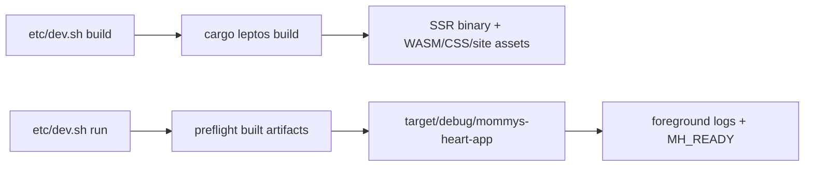

# Make development run built artifacts without watching and prevent 4 GiB debug links

## Problem

The current development workflow has two related sources of wasted time and failed
builds:

1. `etc/dev.sh run` defaults to `cargo leptos watch` (`etc/dev.sh:44-59`). It
   remains a build watcher while an agent tests the app, so source writes can
   trigger builds at exactly the wrong time. The intended workflow is stricter:
   build once, run that exact build in the foreground, stop it before editing,
   then build again when ready.
2. Full development debug metadata has outgrown the ELF/DWARF relocation format
   used by the linker. Cargo's saved diagnostic confirms `rust-lld` failures such
   as `R_X86_64_32 out of range: 4868850474 is not in [0, 4294967295]` in
   `.debug_info` and `.debug_macro`. This is not 4 GiB of runtime RAM: it is more
   than 4 GiB of linked debug sections. A current SSR `rlib` is 3.94 GB by itself,
   the build tree has reached 40 GB, and a previous task could complete only with
   the one-off workaround `CARGO_PROFILE_DEV_DEBUG=0`.

`etc/dev-db.sh` no longer exists; it was consolidated into `etc/dev.sh`. This task
applies the requested behavior to the current entry point.

## Decisions

- `build` remains the only compile step and continues to use
  `cargo leptos build`, producing the SSR executable, WASM bundle, CSS, and site
  assets together.
- `run` executes the already-built development SSR executable directly. It does
  not invoke Cargo, cargo-leptos `watch`, or cargo-leptos `serve`, and therefore
  cannot rebuild in response to edits.
- Keep the existing foreground console and `MH_READY` / `MH_FAILED` socket-based
  readiness contract. SIGINT/SIGTERM must still reach the app and leave no
  orphaned process.
- When `run` exits for any reason, stop this checkout's database and storage
  containers while preserving their volumes/data. `clean` globally removes all
  Mommy's Heart dev containers, app data volumes, generated environment files,
  and port reservations.
- Set development debug info to Cargo's reduced/limited level (`debug = 1`) in
  the repository profile. This keeps line tables useful for source locations,
  breakpoints, stack traces, and ordinary line-level debugging while omitting the
  full type/variable DWARF that is overflowing the 32-bit section relocations.
  Release settings remain unchanged. This is preferable to `debug = 0`, which
  fixes linking by discarding all source-level debug information, and to merely
  changing linkers, because the captured failure already occurs with current
  `rust-lld`.

## Implementation

### 1. Separate build and execution completely

Update `etc/dev.sh`:

- Keep `cmd_build` as the explicit `cargo leptos build` operation.
- Make the preflight check require both the executable
  (`target/debug/mommys-heart-app`) and generated package assets under
  `target/site/pkg/`; report the existing actionable build-first error if either
  is absent.
- Replace the cargo-leptos subcommand override behavior with direct execution of
  the built SSR binary. Any supported trailing arguments become application
  arguments, not cargo-leptos commands.
- Generalize/rename the readiness helper so it launches the supplied executable
  as its child rather than hard-coding `cargo leptos`. Preserve streamed output,
  real TCP readiness polling, early-failure status propagation, and signal
  forwarding.
- Correct stale internal comments and generated `.env.local` comments that still
  name the deleted `dev-db.sh` / `dev-run.sh` scripts.
- Install cleanup before startup so normal termination, signals, failed
  preflight, and early app exit all stop the current instance's containers.
- Make `clean` discover and remove all `mh-db-*` / `mh-storage-*` containers,
  Mommy's Heart data volumes, generated env files referenced by reservations,
  and every reservation while leaving unrelated containers/volumes/files alone.

After this change, the process model is:

There is no watcher or compiler below `run`.

### 2. Bound development debug metadata

Add a `[profile.dev]` section to `Cargo.toml` with `debug = 1`, accompanied by a
short comment recording the 4 GiB DWARF relocation reason. Do not change the
release profile or add machine-specific linker paths/flags.

This repository-level profile must cover all development entry points, including
`cargo leptos build`, the isolated `target/oneshot` commands, and seed builds, so
agents no longer need to remember an environment-variable workaround.

### 3. Align maintained guidance

Update `README.md` and relevant comments in `.gitignore` / `etc/dev.sh` so
they describe the new non-watching workflow. Add a concise blurb to `AGENTS.md`
with the exact operating loop agents should follow, for example:

> Run `etc/dev.sh build`, then start `etc/dev.sh run` and wait for `MH_READY`.
> Test against that foreground process, stop it before editing, then rebuild and
> start a fresh run for the next test pass. `run` never watches or recompiles.

Keep the existing readiness and one-shot target-directory guidance accurate
without referring to a live cargo-leptos watcher.

Do not rewrite historical completed task files.

## Verification

1. From a clean development target, run `etc/dev.sh build` without
   `CARGO_PROFILE_DEV_DEBUG=0`; it must complete the SSR + WASM build without an
   out-of-range relocation.
2. Run a native linking command through the isolated path, such as
   `etc/dev.sh -- cargo build --no-default-features --features ssr`; it must also
   link successfully under the checked-in profile, covering the path that
   produced the captured failure.
3. Record representative post-build artifact and target-directory sizes to show
   the oversized full-DWARF artifacts are no longer being generated.
4. Start `etc/dev.sh run`, wait for `MH_READY`, request the printed URL, and
   perform a focused browser smoke check with a clean console.
5. While it is running, inspect its process tree and verify there is no `cargo`,
   `cargo-leptos`, or watcher process. A temporary source-content change must not
   alter the binary or trigger build output; restore the probe immediately.
6. Terminate `run` with SIGINT/SIGTERM and verify prompt exit with no orphaned app
   process. Also force an early startup failure and confirm `MH_FAILED` plus a
   non-zero status.
7. Run formatting and the repository's SSR and hydrate compile checks. Do not add
   Cargo tests, per repository convention.

## Definition of done

Development compilation and execution are distinct: `build` creates a complete
app, `run` holds the foreground console for exactly that build without watching
or recompiling, and stopping it cleanly ends the app. Normal checked-in
development settings link successfully below the DWARF 4 GiB boundary while
retaining useful line-level debugging, with no per-command workaround required.

## Outcome

Implemented the explicit build/run lifecycle and linker fix:

- `run` now launches only the existing development SSR binary, keeps it in the
  foreground, preserves `MH_READY` / `MH_FAILED`, and never invokes a compiler or
  watcher;
- every `run` exit stops that checkout's database and storage containers while
  retaining their volumes, and `clean` removes all Mommy's Heart dev instances,
  app volumes, generated env files, and port reservations;
- development builds use reduced debug information (`debug = 1`) rather than
  full DWARF, avoiding the 4 GiB relocation overflow while retaining line-level
  source debugging; and
- maintained agent and README guidance documents the build, run, stop, edit,
  rebuild loop.

Verification completed with shell/format/diff checks, a full SSR+WASM build with
no debug environment override, a native isolated link, SSR and hydrate compile
checks, HTTP/browser smoke testing with a clean console, foreground process-tree
inspection, a no-watch source-content probe, normal and early-failure shutdown
checks, and an isolated fake-backend test of global cleanup. The full build tree
was 4.9 GiB; its SSR binary was 348 MB and app rlib 367 MB, versus the observed
40 GiB tree and 3.94 GB rlib produced with full debug metadata.
