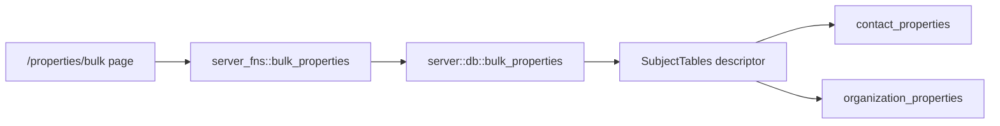

# Bulk edit properties for contacts and organizations

A shared workspace where a user names one property (section + name), searches and
filters people or organizations — including *by* their existing properties —
selects many from a paged list, and saves the same value onto all of them at once.

Scope is deliberately one operation: **set value** (add the property when the
record does not have it, overwrite when it does). Clear/remove/add-only are
deferred; the module is shaped so they can be added later without reworking
selection or the UI.

## Why a new shared module

`contact_properties` and `organization_properties` are structurally identical
(`owner_id, ord, key, value, section`, key non-empty) and their server_fn and db
modules are near line-for-line copies. Rather than writing the bulk path twice,
this adds one subject-parameterised module and leaves the two existing per-record
modules and panels untouched.

The selection model is copied from the existing contact-mail campaign tool
(`ContactMailSelection`), which already solved "filter, snapshot the filters,
tick individuals or select-all-matching with exceptions" — same idea, same
server-side re-resolution of "all matching", so the browser is never trusted with
the record set.



## 1. Shared types and server functions — new `src/server_fns/bulk_properties.rs`

```rust
pub enum PropertySubject { People, Organizations }   // serde snake_case

pub struct PropertyRef { pub section: String, pub key: String }

pub enum PropertyValueMatch { Any, Missing, Blank, Filled, Equals(String), Contains(String) }

pub struct PropertyCondition { pub property: PropertyRef, pub value: PropertyValueMatch }

pub struct BulkPropertyFilters {
    pub keyword: String,
    pub contact_type: Option<ContactType>,           // People only
    pub organization_id: String,                     // People only
    pub organization_kind: Option<OrganizationKind>, // Organizations only
    pub include_archived: bool,
    pub condition: Option<PropertyCondition>,        // filter BY existing properties
}

pub struct BulkPropertyCandidate {
    pub id: String,
    pub name: String,
    pub subtitle: String,              // organization name / kind label
    pub archived: bool,
    pub current_value: Option<String>, // target property's value today; None = absent
}

pub struct BulkPropertySelection {
    pub all_matching: bool,
    pub filters: BulkPropertyFilters,
    pub ids: Vec<String>,
    pub excluded_ids: Vec<String>,
}

pub struct BulkPropertyEdit { pub property: PropertyRef, pub value: String }

pub struct BulkPropertyPreview { pub total: i64, pub will_add: i64, pub will_overwrite: i64,
                                 pub unchanged: i64, pub at_property_limit: i64 }

pub struct BulkPropertyOutcome { pub added: i64, pub overwritten: i64,
                                 pub unchanged: i64, pub skipped: Vec<String> }

pub struct PropertyKeyOption { pub section: String, pub key: String, pub usage_count: i64 }
```

Server functions, all gated by `require_user` +
`require_information_management_access` + `crate::server_fns::crm::require_staff`
(matching `list_contacts` / `set_contact_properties`), each taking
`subject: PropertySubject`:

- `list_bulk_property_candidates(subject, filters, target: PropertyRef, offset, limit) -> Page<BulkPropertyCandidate>`
  — `target` is passed so each row can show its current value for the property
  being edited, i.e. what is about to be overwritten.
- `list_property_key_options(subject) -> Vec<PropertyKeyOption>` — distinct
  `(section, key)` pairs already in use, ordered by usage, unioned with the
  code-owned defaults from `helpers::new_crm_fields`. Powers the "choose the
  property" picker; free text is still allowed for a brand-new property.
- `preview_bulk_property_edit(subject, selection, edit) -> BulkPropertyPreview`
  — read-only; resolves the selection exactly as apply will and counts outcomes.
- `apply_bulk_property_edit(subject, selection, edit) -> BulkPropertyOutcome`.

Use `input = leptos::server_fn::codec::Json` on the ones carrying the nested
selection struct, as `contact_mail` does.

Validation reuses the existing constants from `server_fns::contact_properties`
(`MAX_KEY_CHARS`, `MAX_VALUE_CHARS`, `MAX_PROPERTIES`). New constant
`MAX_BULK_TARGETS = 1000`: a request resolving to more than that is refused with
"Narrow the filters — a single bulk save can change at most 1000 records." A
property write is cheap enough to do inline in one transaction, so unlike contact
mail this needs no background task.

## 2. Persistence — new `src/server/db/bulk_properties.rs`

One `SubjectTables` descriptor of `&'static str`s per subject, chosen by matching
on `PropertySubject`. **No identifier ever comes from client input** — the enum
maps to a compile-time const — and every value is bound, so the `format!`-built
SQL is as safe as the existing `contacts::page`.

```rust
struct SubjectTables {
    properties_table: &'static str,   // contact_properties | organization_properties
    owner_column: &'static str,       // contact_id | organization_id
    select_columns: &'static str,     // id, display name, subtitle, archived
    from_joins: &'static str,
    where_sql: &'static str,          // keyword / type / org / kind / archived
    entity: audit::Entity,            // Contact | Organization
}
```

Functions:

- `candidate_page(subject, filters, target, offset, limit)` — the subject's base
  `WHERE`, plus, when `filters.condition` is set, an `EXISTS` / `NOT EXISTS`
  subquery against the properties table matched on
  `lower(btrim(key)) = $n AND lower(btrim(section)) = $m` — the same
  normalisation `helpers::new_crm_fields::normalize_property_part` does in Rust,
  so bulk matching and the existing defaults logic agree. `Missing` becomes
  `NOT EXISTS`; `Blank` / `Filled` / `Equals` / `Contains` become `EXISTS` with an
  extra value predicate. `current_value` comes from a `LEFT JOIN LATERAL` on the
  same match.
- `resolve_target_ids(subject, selection)` — when `all_matching`, re-runs the
  filter query server-side and subtracts `excluded_ids`; otherwise cleans and
  dedupes `ids`. Single source of truth for both preview and apply.
- `preview(subject, ids, edit)` — classifies each target: absent → add; present
  and different → overwrite; present and equal → unchanged; absent but already at
  `MAX_PROPERTIES` rows → at-limit.
- `apply(subject, ids, edit, actor_user_id, actor)` — one transaction:
  1. `audit::set_actor_in_transaction` once.
  2. Per record, find the matching row by normalised `(section, key)`.
     - Found and value differs → `UPDATE ... SET value = $v` for that `ord`.
       **Keeps the stored row's existing `key`/`section` spelling and `ord`**, so
       a bulk save never reorders or re-cases someone's existing list.
     - Found and value equal → no write, counted `unchanged`, no audit row.
     - Absent → `INSERT` at `max(ord) + 1` using the typed section/key spelling.
       If the record already holds `MAX_PROPERTIES` rows, skip it and report it in
       `skipped` rather than failing the whole batch.
  3. One `audit::record_in_transaction` per *changed* record, entity = the
     subject's entity, field `"properties"`, detail `bulk set "<Section> / <Key>"`.
     No-ops write no audit rows, matching the existing "audit only when it
     actually changes" behaviour in `contact_properties::replace`.

Register `pub mod bulk_properties;` in `src/server/db/mod.rs` and
`src/server_fns/mod.rs`.

No migration. The property tables are small; if the `EXISTS` filter turns out
slow later, an expression index on `(lower(btrim(section)), lower(btrim(key)))`
can be added then.

## 3. UI — new `src/pages/bulk_properties.rs`, route `/properties/bulk`

`BulkPropertiesPage` wrapped in `require_information_management_access` +
`Layout`, laid out as the same numbered three-step workspace as
`src/pages/contact_mail.rs` (reuse its `INPUT` / `LABEL` / `PANEL` idiom and its
`search_generation` guard so out-of-order responses cannot clobber the list).

**Subject toggle** at the top: "People" / "Organizations". Switching subjects
clears the selection and re-runs the search; it is the only thing that changes
which filter controls are shown.

**Step 1 — Choose the property.** Section and property-name inputs, each backed
by a `<datalist>` of `list_property_key_options` for that subject, so "I want
*this* property with *this* section" is one pick but a new name can still be
typed. Then the value to set. A short note that a blank value is allowed and means
"named but not answered yet", consistent with the per-record panel.

**Step 2 — Find and select records.** Keyword box; contact-type + organization
pickers for People, kind picker for Organizations; "include archived" toggle; and
the property condition ("only records where <section / name> is any / missing /
blank / filled / equals / contains …"), defaulting to the property chosen in
step 1 so the common "find everyone missing this and fill it in" flow is two
clicks. Paged 50-at-a-time table with a checkbox per row showing name, subtitle,
and **current value of the target property**; "Select all N matching", "Select
visible", "Clear selection", with the same `all_matching` + `excluded_ids`
semantics as the mail tool.

**Step 3 — Review and apply.** Calls `preview_bulk_property_edit` and shows "will
add to X, overwrite Y, leave Z unchanged" plus any at-limit count, then a
confirmation naming the property and count, then `apply_bulk_property_edit` and
an outcome summary listing any skipped records. On success the candidate list
refreshes so the new values are visible.

Register the module in `src/lib.rs`'s `pages` block and add
`<Route path=path!("/properties/bulk") view=BulkPropertiesPage />` to
`src/app.rs`.

**Entry points** (no new navbar item): a "Bulk edit properties" link in the header
button row of `src/pages/contacts.rs` (beside the existing "Send mail" button,
~line 818) and of `src/pages/organizations.rs`, each linking to
`/properties/bulk` with the matching subject preselected via a
`?subject=people|organizations` query parameter read on mount.

## Non-goals

- No clear / remove / add-only operations yet (`BulkPropertyEdit` is shaped so
  they slot in as an operation enum later).
- No renaming a property across records, and no reordering.
- No background task or progress polling — the write is bounded and synchronous.
- `contact_properties` / `organization_properties` and their per-record panels are
  not refactored or merged.

## Verification

1. `etc/dev.sh -- cargo check --no-default-features --features ssr`
2. `etc/dev.sh build`, then `etc/dev.sh run` and wait for `MH_READY`.
3. People: set "Relationship / Relationship status" = "Active" on a handful of
   ticked contacts; confirm each contact page shows the value under the right
   section, that records which already had it were overwritten, and that the
   Change Log on one of them shows a single properties entry.
4. Add a *new* section/property that no contact has; confirm it is appended at the
   end of each list and does not disturb existing rows or their order.
5. Filter by property: choose "is missing", use "Select all N matching", apply,
   then re-run the same filter and confirm it now returns nothing.
6. Re-apply the identical value to the same selection; confirm it reports all
   unchanged and adds no new Change Log entries.
7. Repeat 3–5 with the Organizations subject.
8. Sign in as a user without information-management access and confirm
   `/properties/bulk` redirects to `/cases` and the entry links are hidden.
