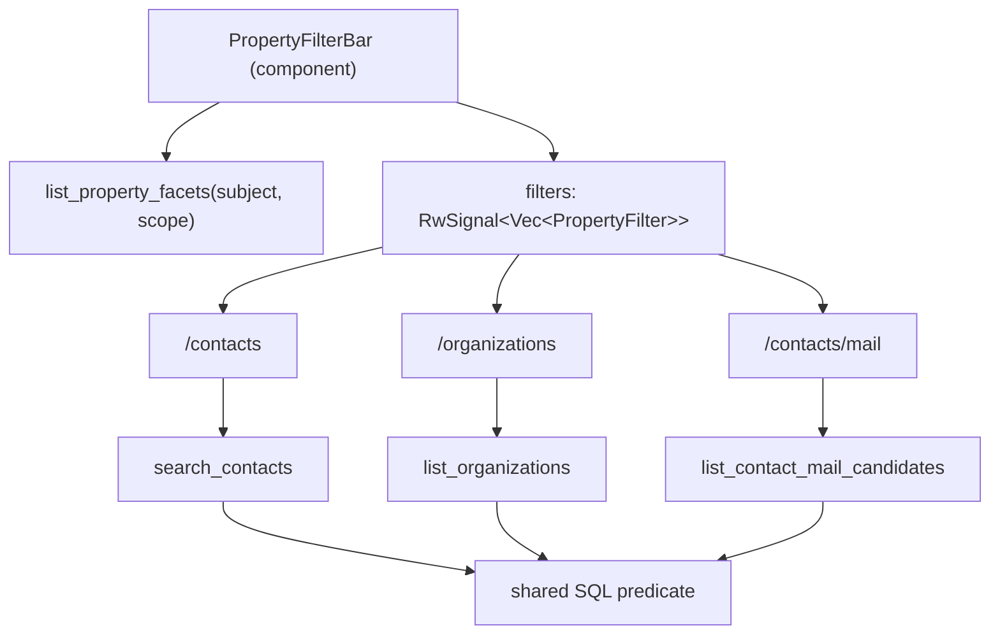

# Filter contacts and organizations by their custom properties

Today the only way to use a property like "Location" is to open one record at a
time. This adds faceted property filtering to the Contacts directory, the
Organizations directory, and the send-mail recipient picker, built once as a
shared component so the three pages do not each grow their own version.

## What the user gets

A "+ Add property filter" button next to the existing search box. Clicking it
opens a popover listing the property names actually in use, each with a count
("Location — 214 people"). Picking one shows the values actually recorded for it,
each with a count ("Boston 61", "Cambridge 22", "— not filled in — 9"), a
type-to-narrow box for long lists, and checkboxes. Applying leaves a removable
chip: `Location: Boston, Cambridge ×`.

- Multiple values inside one property are **OR** (Boston *or* Cambridge).
- Different properties are **AND** (Location: Boston *and* Program: Doula).
- Counts respect the other active filters, and a facet's own chip is excluded
  from its own counts, so values that would return nothing simply disappear.
  This is what makes it feel like a real faceted browser rather than a dropdown.
- Matching records show the filtered property inline on the card
  (`Location · Boston`), so the reason a row matched is visible.
- The plain keyword box also matches property **values**, so typing "Boston"
  finds it without building a filter first. Property *names* are deliberately not
  keyword-matched — searching "location" should not return everyone.
- Active filters live in the URL, so a filtered view can be pasted to someone
  else and reloaded.

## Shape of the change



### 1. Shared vocabulary — `src/server_fns/property_filters.rs` (new)

A cross-cutting module like `crm.rs` and `pagination.rs`, because the same filter
applies to two different top-level objects.

- `PropertyFilter { key: String, values: Vec<String> }` — `key` and `values` are
  the normalized (trimmed, lowercased) forms; an empty string in `values` means
  "named but not filled in".
- `PropertySubject { Contact, Organization }`.
- `PropertyFacet { key, display_key, record_count, values, distinct_values, truncated }`
  and `PropertyFacetValue { value, display_value, count }`.
- `PropertyFacetScope` — the *other* filters in play (keyword, category ids,
  contact type, organization id, organization kind, include_archived, plus the
  active `Vec<PropertyFilter>`). One struct with `Default` covers all three call
  sites; each page fills only the fields it has.
- `encode(&[PropertyFilter]) -> String` / `decode(&str) -> Vec<PropertyFilter>`
  for the URL. Format `key:v1|v2,key2:v3` with `\` escaping for `\ : | ,` so
  values containing punctuation round-trip. Verify round-tripping with a
  throwaway `#[cfg(test)]` block during development and delete it before review
  (per AGENTS.md).
- `clean(Vec<PropertyFilter>) -> Vec<PropertyFilter>`: trim, lowercase, drop
  empty keys, dedupe values, drop filters with no values, cap at 10 filters and
  50 values each. Applied server-side on every entry point.
- `#[server] list_property_facets(subject, scope) -> Vec<PropertyFacet>`.
  Guarded exactly like `list_contact_properties`: `require_user` +
  `require_information_management_access` + `require_staff`. Facet values are
  real contact data, so this must not be laxer than the property panels.

### 2. Facet + predicate SQL — `src/server/db/property_filters.rs` (new)

- Grouping is by `lower(btrim(key))` / `lower(btrim(value))` so "Location",
  "location", and " Location " are one facet. The display label is the most
  common raw spelling (`mode() WITHIN GROUP`).
- `facets(subject, scope)`: restrict to the ids matching `scope` (reusing the
  subject's own filter SQL), group by key, and return the top ~200 keys by record
  count with up to 50 values each ordered by count desc then value asc, setting
  `truncated`. When counting values for key *K*, drop *K*'s own chip from the
  scope.
- `predicate_sql(alias, placeholder)` + `to_json(&[PropertyFilter]) -> String`:
  the one filter fragment all three call sites paste in. Pass the whole filter
  list as **one** bound `TEXT` parameter cast to `jsonb`, so the number of `$n`
  placeholders stays fixed no matter how many chips are active and the existing
  `format!`-with-fixed-`$n` style survives. (sqlx's `json` feature is not
  enabled; binding a `String` and casting in SQL avoids needing it.)

  ```sql
  AND NOT EXISTS (
      SELECT 1 FROM jsonb_array_elements($n::jsonb) AS f
      WHERE NOT EXISTS (
          SELECT 1 FROM contact_properties p
          WHERE p.contact_id = c.id
            AND lower(btrim(p.key)) = f->>'key'
            AND lower(btrim(p.value)) IN (
                SELECT jsonb_array_elements_text(f->'values'))))
  ```

  "No filter fails to match" = AND across filters, OR within one. An empty array
  is a no-op, so unfiltered callers pass `[]`.
- `values_for(subject, ids, keys)`: the filtered properties to show on cards, in
  one bounded query.

### 3. Migration — `migrations/0027_property_filter_indexes.sql` (new)

```sql
CREATE INDEX contact_properties_key_value_idx
    ON contact_properties (lower(btrim(key)), lower(btrim(value)));
CREATE INDEX contact_properties_record_key_idx
    ON contact_properties (contact_id, lower(btrim(key)));
-- and the organization_properties equivalents
```

The keyword-into-values search stays a sequential scan (`%x%` with no `pg_trgm`,
as noted in 0019). That is fine at this data size and matches what the contacts
keyword search already does; say so in a comment rather than adding an extension.

### 4. Wire into the three searches

| Layer | Change |
| --- | --- |
| `server_fns/contact_directory.rs` | `search_contacts` gains `property_filters: Vec<PropertyFilter>`; already JSON-coded, so an empty vec survives the trip. |
| `server/db/contact_directory.rs` | Add the predicate to `search_page`'s filter; add `OR EXISTS (… contact_properties … value ILIKE $2)` to the keyword clause; populate the new `Contact.filtered_properties`. |
| `server_fns/organizations.rs` | `OrganizationFilters` gains `property_filters`. |
| `server/db/organizations.rs` | Same predicate + keyword extension in `page`; populate `Organization.filtered_properties`. |
| `server_fns/contact_mail.rs` | `ContactMailFilters` gains `property_filters`. This matters for correctness: `all_matching` snapshots the filters and re-runs them at send time, so property filters must live in that struct to be honoured. |
| `server/db/contact_mail.rs` | Add the predicate to `candidate_cte()` — one new bind, shared by `candidate_page` and `selected_recipients`, so counting and sending cannot disagree. |

### 5. Component — `src/components/property_filters.rs` (new)

```rust
#[component]
pub fn PropertyFilterBar(
    subject: PropertySubject,
    filters: RwSignal<Vec<PropertyFilter>>,
    scope: Signal<PropertyFacetScope>,
) -> impl IntoView
```

Owns the popover, facet fetching (debounced, generation-guarded like the existing
search effects), the value list, and the chips. It does **not** touch the URL —
the pages decide that, because a half-composed mail campaign is not a shareable
view. Styling reuses the existing `INPUT` / badge-pill / `rounded-xl border
border-slate-800 bg-slate-900` vocabulary; no new design language.

### 6. Pages

- **`src/pages/contacts.rs`** — bar in the left `aside` above "Filter
categories"; chips row above the results list. Mirror `q`, `type`, `org`, `cat`,
`archived`, and `props` into the query string with `use_query_map` +
`use_navigate(.., replace: true)`, seeded from the URL on load (the pattern in
`admin_manage_users.rs`).
- **`src/pages/organizations.rs`** — bar under the existing filter grid. Property
chips apply immediately (the popover's Apply is already the explicit commit), and
fold into `applied` so the existing "Apply filters" button does not clobber them.
Mirror `q`, `kind`, `archived`, `props`.
- **`src/pages/contact_mail.rs`** — bar in the step 1 filter block, feeding
`applied_filters`. Changing a chip must reset the current selection the same way
the other filters do, so a stale tick cannot survive a filter change. No URL sync.

### 7. Seed (optional but recommended)

`src/server/db/seed.rs` has no `Location` property, so the feature looks empty on
a fresh database. Add `Location` to a handful of seeded contacts and
organizations with a few repeated values so `etc/dev.sh reset` gives something to
filter immediately.

### 8. Docs

Add a short entry to `docs/case-management/delivered.md` beside the existing
"Contact properties — custom fields on a person" section.

## Verification

- `etc/dev.sh -- cargo check --no-default-features --features ssr`
- `etc/dev.sh build`, then `etc/dev.sh reset` and `etc/dev.sh run`.
- On `/contacts`: add a `Location` filter, confirm counts, confirm multi-value OR,
  confirm a second property ANDs, confirm the chip shows on matching cards,
  confirm the URL updates and a fresh load of that URL restores the view.
- Confirm keyword "Boston" finds property-only matches.
- Repeat the core path on `/organizations`.
- On `/contacts/mail`: apply a property filter, tick "all matching", and confirm
  the recipient count in the review step matches the filtered candidate count.
- Confirm a volunteer without information-management access still gets the
  existing refusal from every new server function.
