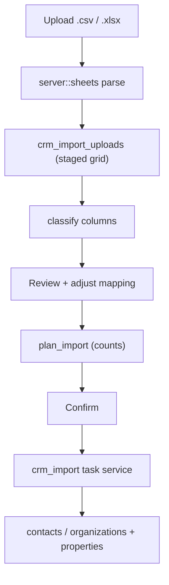

# Import contacts and organizations from a spreadsheet

A new admin workspace that takes a CSV or Excel file, shows exactly what each
column will set before anything is written, and runs the write as one cancellable
background task with live progress.

Modelled on the two tools it sits beside: the **bulk edit** page for its shape,
location, and discoverability (numbered step panels, subject toggle, an entry
button in the Contacts and Organizations header rows), and the **contact mail**
page for its "exactly one task at a time, poll it, cancel it" machinery.

The interesting part is step 3. An import that silently invents
`Physical Location` alongside an existing `Location` quietly corrupts the
property vocabulary, and nobody notices for months. So the mapping review is not
a formality here — it is the feature.



## Decisions taken up front

| Question | Decision |
| --- | --- |
| File formats | `.csv`, `.tsv`, `.xlsx`. **Not** legacy `.xls` (binary BIFF) — rejected with "re-save as .xlsx or .csv" |
| New crates | **None.** `.xlsx` is parsed with the `zip` + `quick-xml` SSR deps already used for `.docx`; CSV is a small RFC 4180 reader |
| Caps | 10 MB file, 5 000 data rows, 100 columns, 500 chars/cell |
| Duplicate handling | Explicit user choice, defaulting to "update the existing record" — a re-run must not double the database |
| Match key | Contacts: email (case-insensitive). Organizations: name (normalized) |
| Concurrency | One import task site-wide, same as contact mail |

## 1. Sheet parsing — new `src/server/sheets.rs`

No new dependency. `.xlsx` is an OOXML zip, exactly like the `.docx` files
`src/server/rag/documents.rs:218` and `src/server/docs.rs:94` already open with
`zip::ZipArchive` and stream with `quick_xml::Reader`. This follows that
precedent rather than adding `calamine`, which also keeps the build offline-safe.

```rust
pub struct Sheet { pub headers: Vec<String>, pub rows: Vec<Vec<String>> }

pub fn parse(file_name: &str, bytes: &[u8]) -> Result<Sheet, String>
```

- **CSV/TSV** — hand-rolled RFC 4180: strips a UTF-8 BOM, honours quoted fields
  containing commas, quotes (`""`), and newlines, and sniffs the delimiter
  (`,` `;` `\t`) from the header line. Lossy UTF-8 decode so one bad byte cannot
  fail a 4 000-row import.
- **XLSX** — read `xl/workbook.xml` for the first sheet, resolve it through
  `xl/_rels/workbook.xml.rels`, load `xl/sharedStrings.xml` into a string table,
  then stream the sheet. Cells are placed **by their `r="B7"` reference**, not by
  arrival order, so blank cells cannot shift a whole row one column left. Handles
  shared (`t="s"`), inline (`t="inlineStr"`), and literal values; dates are taken
  as their stored text.
- Trailing fully-blank rows and columns are dropped; a duplicate header gets a
  ` (2)` suffix so every column stays addressable.

## 2. Shared types — new `src/server_fns/crm_import.rs`

Reuses `PropertySubject` from `server_fns::property_filters`, so "People vs
Organizations" means the same thing here as in bulk edit.

```rust
pub enum CoreField {           // subject-dependent; labels come from the enum
    FirstName, LastName, PreferredName, Email, Phone, Mobile, Address,
    JobTitle, OrganizationName, ContactTypes, Source, Description, DoNotContact,
    OrgName, OrgKind, OrgWebsite, OrgPhone, OrgEmail, OrgAddress, OrgDescription,
}

pub enum ColumnTarget {
    Ignore,
    Core(CoreField),
    Property { section: String, key: String },
}

/// Why the column is mapped the way it is — drives the review UI.
pub enum MatchKind {
    CoreField,         // header matched a built-in field
    ExistingProperty,  // exact normalized (section, key) already in use
    SectionConflict,   // same property name, different section  <- review
    SimilarProperty,   // close to an existing property          <- review
    NewProperty,       // genuinely new
    Ignored,
}

pub struct PropertySuggestion {
    pub section: String, pub key: String,
    pub usage_count: i64, pub reason: String,   // "Location is used by 84 people"
}

pub struct ColumnPlan {
    pub index: usize,
    pub header: String,
    pub target: ColumnTarget,
    pub match_kind: MatchKind,
    pub note: String,                        // one plain sentence: what this sets
    pub suggestions: Vec<PropertySuggestion>,
    pub sample_values: Vec<String>,          // first few non-empty, for context
}

pub struct ImportPreview {
    pub upload_id: String, pub file_name: String, pub sheet_name: String,
    pub row_count: i64, pub headers: Vec<String>,
    pub sample_rows: Vec<Vec<String>>,       // first 5 data rows
    pub columns: Vec<ColumnPlan>,
}

pub struct ImportPolicy {
    pub on_match: MatchAction,               // Update | Skip | CreateAnyway
    pub create_missing: bool,                // create records with no match
    pub link_organization_by_name: bool,     // contacts only
    pub create_missing_organizations: bool,  // contacts only
}

pub struct ImportPlan {
    pub total_rows: i64, pub will_create: i64, pub will_update: i64,
    pub will_skip: i64, pub invalid: i64,
    pub new_properties: Vec<String>,         // named, so the confirm text can list them
    pub needs_review: i64,                   // columns still flagged
    pub warnings: Vec<String>,
}
```

Server functions, each gated by `require_user` + `require_operations_admin` +
`require_information_management_access` (the pair `contact_mail` uses — this is
an operations/site-admin tool):

- `upload_import_file(data: MultipartData) -> ImportPreview` — `input =
  MultipartFormData`, exactly the shape of `evidence::upload_evidence`
  (`src/server_fns/evidence.rs:122`). Fields: `file`, `subject`. Parses, caps,
  stages the grid, classifies the columns, returns the preview.
- `plan_import(upload_id, subject, columns, policy) -> ImportPlan` — recomputed
  whenever the user changes a mapping, so the numbers on screen always describe
  the mapping on screen.
- `start_import_task(upload_id, subject, columns, policy) -> CrmImportTask`
- `load_import_task() -> Option<CrmImportTask>`
- `cancel_import_task(task_id) -> CrmImportTask`

JSON codec (`input = leptos::server_fn::codec::Json`) on the ones carrying the
nested mapping, as `contact_mail` and `bulk_properties` do. The multipart body
limit is already 26 MB globally — `evidence::install` layers
`DefaultBodyLimit::max` over the whole router — so a 10 MB import fits with no
router change.

Validation reuses the existing limits rather than inventing new ones:
`MAX_NAME` / `MAX_SHORT_TEXT` / `MAX_LONG_TEXT` from `server_fns::crm`, and
`MAX_KEY_CHARS` / `MAX_VALUE_CHARS` / `MAX_PROPERTIES` from
`server_fns::contact_properties`. Over-long cells are truncated and counted as a
per-row warning rather than failing the row.

## 3. Column classification — the review requirement

For each header, in order:

1. **Core field** — normalized header hits a known alias table
   (`"email"`/`"e-mail"`/`"email address"` → `Email`, `"company"`/`"organisation"`
   → `OrganizationName`, …). `MatchKind::CoreField`.
2. Otherwise compare against the subject's property vocabulary —
   `bulk_properties::key_options` (distinct in-use `(section, key)` pairs with
   usage counts) unioned with the code-owned defaults in
   `helpers::new_crm_fields`. Comparison uses the existing
   `normalize_property_part`, so matching means the same thing it already means
   everywhere else:
   - exact `(section, key)` → `ExistingProperty`
   - same `key`, different `section` → **`SectionConflict`**
   - word-boundary containment (`"Physical Location"` ⊃ `"Location"`),
     token Jaccard ≥ 0.5, or Levenshtein ratio ≥ 0.82 (`"Phone Numer"` vs
     `"Phone Number"`) → **`SimilarProperty`**
   - nothing close → `NewProperty`

Every flagged column carries its `suggestions` with usage counts, and every
column carries a `note` written as a plain sentence — *"Sets the property
**Location** under **Contact info**, which 84 people already have"* / *"Creates a
new property **Physical Location** under **General**"*. That sentence is the
answer to "show me what this will actually set".

Classification is advisory only: the user's chosen `ColumnTarget` is what the
import obeys, and it is re-validated server-side before the write.

## 4. Persistence — new migration `0028_crm_import.sql`, `src/server/db/crm_import.rs`

Three tables, mirroring `0026_contact_mail_tasks.sql`:

- `crm_import_uploads` — the staged grid as `jsonb`, plus `uploaded_by_id`,
  `file_name`, `row_count`, `created_at`. Owned by its uploader, purged after 24
  hours by a retention task registered like the existing ones. Staging server-side
  is what lets the user retarget a column and re-plan without re-uploading.
- `crm_import_tasks` — `id`, `status` (`queued`/`running`/`cancelling`/
  `completed`/`cancelled`/`failed`), `subject`, `file_name`, `mapping jsonb`,
  `policy jsonb`, `row_total`, `created_count`, `updated_count`, `skipped_count`,
  `failed_count`, creator, timestamps, cancellation fields, `error`, `seq`.
- `crm_import_rows` — `(task_id, position)`, `status`, `record_id`, `label`,
  `error`. This is what makes "row 412: invalid email" reportable instead of a
  bare failure count.

Functions: `stage_upload`, `load_upload`, `start_task`, `record_row`,
`finish_task`, `latest_task`, `fail_interrupted_tasks`, `purge_expired_uploads`.

## 5. Task service — new `src/server/crm_import.rs`

A direct structural copy of `src/server/contact_mail.rs`: a `OnceLock` service
holding `Arc<Mutex<Option<ActiveTask>>>`, `start()` refusing while another task
is active ("Another import is still running."), `cancel()` via `Notify`,
`current_task()`, and `initialize()` — called from `main.rs` beside
`contact_mail::initialize()` — which closes rows left active by a dead process.

`run_task` walks the staged rows. Each row is its own transaction:

1. `audit::set_actor_in_transaction` with the importing user.
2. Resolve the match (email / name). Apply `on_match` / `create_missing`.
3. Write core fields through the same cleaning path as the normal editors.
4. Merge properties the way `bulk_properties::apply` does — an existing row keeps
   its stored spelling and `ord` and only its value changes; a new one is
   appended at `max(ord) + 1`; a record already at `MAX_PROPERTIES` is skipped
   and reported. Blank cells never blank out existing data.
5. One `audit::record_in_transaction` per changed record.

A failing row is recorded and the import continues; counters update per row so
the polled progress actually moves. Cancellation is checked between rows, so
rows already committed stay committed and the panel says so.

## 6. UI — new `src/pages/crm_import.rs`, route `/import`

`CrmImportPage`, wrapped in `require_operations_admin` +
`require_information_management_access` + `Layout`, reusing the `INPUT` / `LABEL`
/ `PANEL` consts and numbered-panel layout of `bulk_properties.rs`.

**Subject toggle** at the top — "People" / "Organizations", the same
`PropertySubject::ALL` button pair as bulk edit. Switching it clears the upload
(the mapping is meaningless against the other subject). Preselected from
`?subject=contact|organization`.

1. **Choose a file.** `<input type="file">` (`web-sys` already enables `File`,
   `FileList`, `FormData`, `HtmlInputElement` — no Cargo change), posting a
   `FormData` to `upload_import_file`. Accepted formats and caps stated up front.
2. **Check the file.** Sheet name, row count, and a horizontally scrollable table
   of every column header with the first 5 rows underneath — requirement 3.
3. **Review the mapping.** One card per column: header → target `<select>` (core
   fields, every existing property, "New property", "Ignore"), a section input
   backed by a `<datalist>`, the plain-sentence note, and sample values.
   `SectionConflict` and `SimilarProperty` cards are amber and pinned to the top
   with a one-click **"Use Location (Contact info)"** adopt button beside
   **"Keep as a new property"**. A counter — *"2 columns need review"* — sits in
   the panel header. Requirements 4 and 5.
4. **Duplicates.** The `ImportPolicy` controls, stating the match key in words.
5. **Import.** `plan_import` results as tiles (create / update / skip / invalid),
   the list of properties about to be created, then an **Import** button behind a
   `confirm()` naming the counts and any new properties. Requirement 6.

**Task panel** — an `ImportTaskProgress` component built like
`contact_mail.rs`'s `TaskProgress`: polled every 2 s with
`set_interval_with_handle` + `on_cleanup`, status pill, progress bar, created /
updated / skipped / failed tiles, a cancel button while active, and a
`<details>` list of failed rows with their row numbers. While a task is active
the whole form is wrapped in a disabled `<fieldset>`, so a second import cannot
be started from the page, and the server refuses one anyway. Requirement 7.

**Entry points** — a "Import from file" button beside the existing "Bulk edit
properties" button in the header row of `src/pages/contacts.rs:922` and
`src/pages/organizations.rs:242`, each carrying the matching `?subject=`.
Same place, same treatment, same discoverability.

Register the page in `src/lib.rs`, the route in `src/app.rs`, and the modules in
`src/server/mod.rs`, `src/server/db/mod.rs`, `src/server_fns/mod.rs`.

## Non-goals

- No legacy `.xls`, no multi-sheet selection (first sheet only), no Google Sheets.
- No saved/reusable mapping templates.
- No undo. The change log records every write, and "skip duplicates" plus the
  preview is the safety net.
- No import for cases, funding, or grants.
- Contact **categories** are not created from a column in this pass; category-ish
  columns land as properties, as the sender.net import did.

## Verification

Test fixtures are generated into a scratch directory (not committed): a clean
contacts CSV, an organizations CSV, an `.xlsx` with blank cells mid-row and a
quoted multi-line address, and a deliberately messy CSV whose headers exercise
every `MatchKind` — `Preferred Contact Method` (exact, differing case),
`Prefered contact method` (typo → similar), `Relationship Status` under a new
section (section conflict), `Physical Location` against a `Location` property
seeded via bulk edit (similar), and `Favourite Colour` (genuinely new).

1. `etc/dev.sh -- cargo check --no-default-features --features ssr`
2. `etc/dev.sh build`, then `etc/dev.sh run` and wait for `MH_READY`.
3. Sign in as `admin@mommysheart.org` / `admin123`. Confirm the new button sits
   beside "Bulk edit properties" on both Contacts and Organizations.
4. Upload the contacts CSV: verify the header/sample preview, that `Email` and
   `First Name` are recognised as core fields, and that each property column's
   note reads correctly. **Screenshot.**
5. Upload the messy CSV: verify the typo and the section conflict are flagged
   amber and pinned, adopt one suggestion, keep one as new, and confirm the
   review counter drops. **Screenshot.**
6. Import with "create missing": confirm the flow, watch progress advance, then
   open an imported contact and check the core fields and that properties landed
   under the right sections in the right order. **Screenshot of the progress
   panel mid-run and the finished panel.**
7. Re-import the same file with "update existing": confirm it reports updates and
   zero creates, and that no duplicate contacts exist.
8. Re-import with "skip duplicates": confirm zero writes and a clean summary.
9. Start an import and, while it runs, confirm the form is disabled, a second
   start is refused, and cancelling stops it with rows already written intact.
10. Upload a malformed file and an over-cap file; confirm both fail with a clear
    message and no task is created.
11. Repeat 4–7 for Organizations, including linking contacts to organizations by
    name with "create missing organizations" on.
12. Sign in as a user without information-management access; confirm `/import`
    redirects to `/cases` and the entry buttons are hidden.
