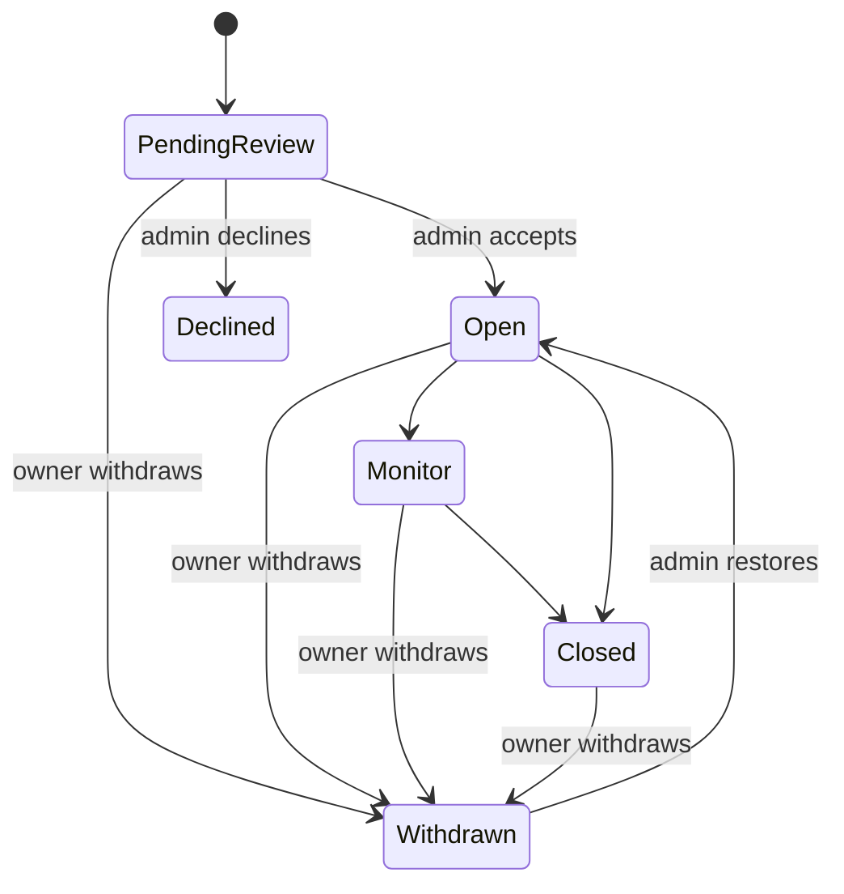

# Let a case owner withdraw a case they filed by mistake

A client (or any user) who opens a case in error needs a way to get it out of
their list. This adds a **withdrawn** case status: the owner takes the case back,
it disappears from their Cases list and Inbox, and only an administrator can
restore it.

## Why a status and not a delete

A case row cannot be deleted at all. `cases` cascades to `case_channels` and
`case_notes`, and both carry `BEFORE DELETE` triggers that `RAISE EXCEPTION`
unconditionally (`0017_case_messaging_mvp.sql`, `0018_structured_case_notes.sql`).
Every case is given two channels at creation, so `DELETE FROM cases` always
fails. That is deliberate — ADR-0002 and `delivered.md` state the
archive-never-delete doctrine. Withdrawal follows the same reasoning: the case is
frozen and hidden, never destroyed.

## Decisions

- **Who may withdraw:** the owner, from any status except `Declined` and
  `Withdrawn`. Operations admins may also withdraw on an owner's behalf.
- **Gated on ownership, not a capability.** The public signup flow grants the
  client owner every case capability, so capabilities cannot distinguish "this is
  my case" from "I may edit this case". This mirrors `set_case_review_decision`,
  which is gated on account role for the same reason.
- **Visibility:** hidden from the Cases list and the Inbox for every non-admin
  viewer, including assigned volunteers. Still readable by direct link, still in
  the admin directory.
- **Reversibility:** admin only. A restore returns the case to exactly the status
  it held before.

## Implementation

### `migrations/0029_case_withdrawal.sql`

Four `NOT NULL DEFAULT ''` columns on `cases` — `withdrawn_by`, `withdrawn_at`,
`withdrawal_reason`, `status_before_withdrawal` — plus a
`cases_withdrawal_complete` CHECK: a withdrawn row must carry both a timestamp
and a status to restore to, so the state can never become unexplainable or
unrecoverable.

### `CaseStatus::Withdrawn`

The load-bearing part is `accepts_changes() == false`. That single predicate is
already consulted by `permissions::require_cap`, `case_notes::lock_writable_case`,
the chat send gate, and the edit gates in `pages/cases.rs` — so the new variant
freezes the case everywhere at once with no new gate to forget.
`STAFF_SELECTABLE` is left alone, so `Withdrawn` never appears in the staff
status dropdown; it is reachable only through the dedicated server function.

### Server functions — `src/server_fns/cases.rs`

- `withdraw_case(case_id, reason)` — ownership or operations admin, reason capped
  at 1000 chars.
- `restore_case(case_id)` — operations admin only.
- `load_case_summaries_for_user` passes `include_withdrawn` = caller is an
  operations admin.

### Database — `src/server/db/cases.rs`

`withdraw` and `restore` both read the status `FOR UPDATE` inside the transaction
that writes it, so concurrent requests cannot clobber
`status_before_withdrawal`. Each writes its audit entry in the same transaction,
so the existing change log explains the transition for free.
`get_summaries_for_user` and `search_editable` gained the exclusion.

### UI — `src/pages/cases.rs`

A two-step withdraw control in the case detail panel (reveal, optional reason,
confirm) matching the admin decline flow, plus an admin-only restore button and a
line naming who withdrew it and why. `CaseDetail` gained an optional
`on_withdrawn` callback so the Cases page can clear its selection and show a
notice, instead of rendering "Case not found" once the case leaves the list.

## Interaction with account deletion

`cases.owner_id` is `ON DELETE RESTRICT`, so withdrawing a case does **not** make
its owner hard-deletable. If account deletion lands as a soft deactivate, the two
states are orthogonal. Deactivating an account should not cascade-withdraw its
cases: a case with staff work on it belongs to the organization, not the account
that filed it.

## Verification

Manual, in the browser (`etc/dev.sh build` then `run`):

1. Owner withdraws a pending case — gone from Cases and Inbox.
2. Owner withdraws an accepted case with messages — same; the assigned volunteer
   no longer sees it either.
3. Withdrawn case by direct link is read-only.
4. Admin sees it in Manage cases with the badge and the withdrawal note, restores
   it, and it returns to its previous status and reappears for the owner.
5. Withdraw refused on a declined case and on an already-withdrawn one.
6. The change log shows both transitions with the right actor.

Seed data includes `c-9` "Johnson benefits appeal", withdrawn by Emma Johnson, so
the restore path is demoable straight after `etc/dev.sh reset`.
